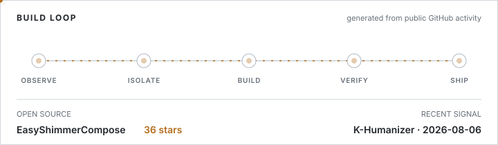

  

# Choi Sangrok

Android Developer / AI-Native Product Engineer

**역할의 경계를 넘어, 아이디어를 제품까지 가져갑니다.**

제품의 문제를 기준으로 기술과 구현 범위를 결정합니다. 
Android 앱은 설계부터 출시 후 운영까지, LLM은 학습부터 평가와 적용 판단까지 맡았습니다.

[Portfolio](https://evergreentree97.github.io) · [Tech Blog](https://velog.io/@evergreen_tree)

 

<picture>
  <source media="(max-width: 600px) and (prefers-color-scheme: dark)" srcset="./assets/profile-signals-mobile-dark.svg">
  <source media="(max-width: 600px) and (prefers-color-scheme: light)" srcset="./assets/profile-signals-mobile-light.svg">
  <source media="(prefers-color-scheme: dark)" srcset="./assets/profile-signals-dark.svg">
  <source media="(prefers-color-scheme: light)" srcset="./assets/profile-signals-light.svg">
  
</picture>

[EasyShimmerCompose](https://github.com/evergreentree97/easy-shimmer-compose) · [K-Humanizer](https://github.com/evergreentree97/K-Humanizer)
